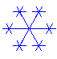
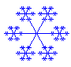
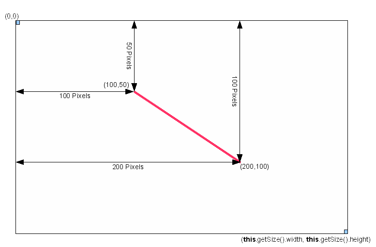
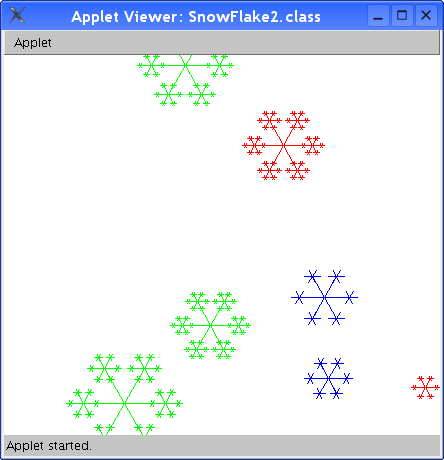

# Lab 4

### Main contents
- **Savitch, Chapter 11** (Recursion)
- **the corresponding lectures from last week**
- **Savitch, Appendix 2** (Running Applets)

### General Reminders
- use `JDK 8 (jdk1.8)` and `JUnit4`

## Before you start

### Drawing a snowflake
A simplified representation of a snowflake can be displayed as a set of six-beamed 
stars where a smaller six-beamed star is displayed at the end of every beam.

<table><tr>
<td border="0"></td>
<td border="0"></td>
<td border="0"></td>
</tr></table>

### Using applets for simple graphics
An applet is a java class which is embedded in an HTML document, which can be displayed 
through a web browser or via the `appletviewer` program.

Every applet `extends JApplet` - or - `extends Applet`. By inheriting from one of 
these 
base classes, the embedding program finds everything it needs to integrate your 
applet's code.

When you run your program, the paint method will be called:

~~~java
public void paint(Graphics canvas)
~~~

The `Graphics` class wraps the graphic environment of the applet. The class has methods to draw graphical shapes like lines, circles and so on. Your applet also knows about the width and the height of the surface where it can draw. All sizes and distances in a 
Java applet are given in pixels. The drawing surface is a coordinate system where the 
coordinates (0,0) are at the upper left corner. The right lower corner has coordinates 
(`this.getSize().width`, `this.getSize().height`).

Let's imagine we want to create an applet that draws a red line from (100,50) to (200,100).

~~~java
import java.applet.Applet;
import java.awt.*;

public class RedLine extends Applet {

    public void paint (Graphics canvas) {
        setBackground( Color.white );
        canvas.setColor(Color.red);
        canvas.drawLine(100,50,200,100);
    }
}
~~~

If you need more information about applets, refer to the Savitch textbook.

## Exercise 1
Complete the code in `Snowflake.java` so that a single snowflake is drawn at the center 
of the window. Make sure that the snowflake fits inside of the window.

To display your code, run `appletviewer Snowflake.html` in your terminal or 
run the program in IntelliJ.

### Drawing a star
To draw a star you need:
- the x-coordinate of the center of the star
- the y-coordinate of the center of the star
- the length of the beams
- the ending x- and y-coordinates of every beam

While the first three variables are provided to the `drawStar()` method as arguments, 
your `drawStar()` method must compute `endX` and `endY` for every beam.

Since the main focus of this assignemt is recursion, the code to compute the variables 
is provided:

~~~java
endX = x + (int) (beamLen * Math.cos(((2 * Math.PI) / 6) * i));	
endY = y - (int) (beamLen * Math.sin(((2 * Math.PI) / 6) * i));
~~~

Your output should look like the third example image.

## Exercise 2

Create a program `RandomSnowflake.java` that draws a random number of snowflakes, with 
random sizes, at random positions, with random colors. Your program should display up 
to 20 snowflakes, which should be clearly 
visible and should fit inside of the window (at least the center of the snowflake must 
be inside of the applets display area). It is alright if the snowflakes overlap, so long as the center
of every snowflake is within the display area.

To display your code's output,  run `appletviewer RandomSnowflake.html` in your 
terminal or run the program in IntelliJ.

To create random numbers, Java provides a class 
[Random](https://docs.oracle.com/javase/8/docs/api/java/util/Random.html). To get a 
random number between 1 and 10, you can use the following code:

~~~java
// if you plan to reuse the Random object
Random randomizer = new Random();
int randomNumber = randomizer.nextInt(10) + 1;

// if you only need to generate a random number once
int randomNumber = new Random().nextInt(10) + 1;
~~~

The methods drawStar() and paint() should be implemented in RandomSnowFlake.java separately from Snowflake.java
This means you should not be trying to call these methods from Snowflake.java, but rather write them again. 
(You might be able to simply copy/paste drawStar(), depending on your code)

