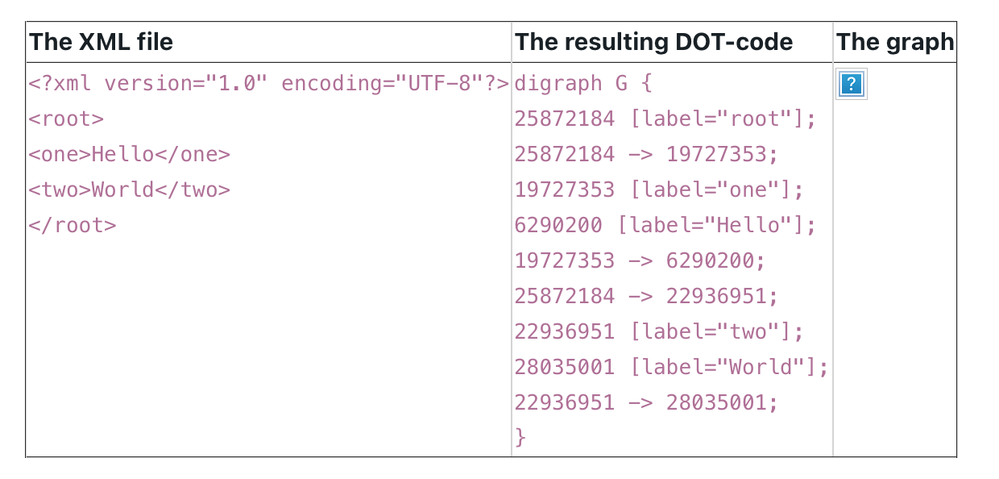
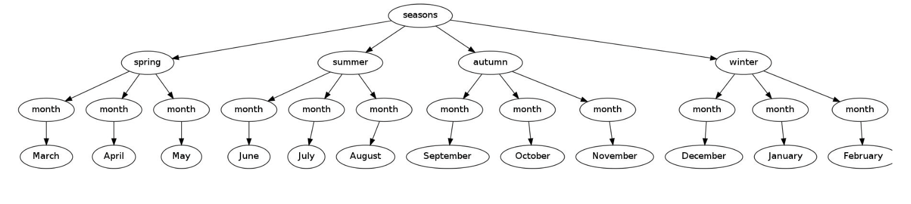

# DOM Parsing

Files: **XML2DOT.java**, **file.xml**

We want to create a program (XML2DOT) which visualizes an XML file. The program takes two arguments on the command line: the input XML file and a second filename which will be created / overwritten by the program. This second file should contain a visualization of the XML in the DOT-language (we used GraphViz and the DOT language already in an earlier task, you can download and install the program from www.graphviz.org).

The DOT language is quite simple:

- For every node in the XML data, we create a label. This label consists of the hashcode of the node and a "label" definition which includes the node's name. For example:

    19727353 [label="one"];
    
    where the number in the beginning is the hashcode of the actual node, followed by the descriptor "label" in [-brackets, taking the node's name ("one") as content.
    
    **We are using the hashcode of the nodes to identify them unique!**

- To create a link between two elements (a parent node and it's child), the DOT file needs one more entry:

    19727353 -> 6290200;

These labels and edges have to be encapsulated into "digraph {" and a closing "}" at the end of the file.

Once your program has written the DOT-code to a file, you can convert it to a JPEG file with:

        dot -Tjpg yourDOTfile.dot -o aJpegFile.jpg

# Exercise
In XML2DOT.java, complete the method private void buildTree(Node aNode). This method is called from the constructor public XML2DOT(String xml) with the root node of the XML file as argument1.

In buildTree, go recursive through the nodes and for every node of type 1 or 32:
- Add a label to the global string dotTree
- Add an edge between the actual node and its parent node to dotTree

The resulting image should look like this:

---
Notes:  
1. In fact, the constructor builds up a DOM object from the XML file. The root node of this DOM object is passed through to buildTree(Node aNode).
2. NodeType 1 represents an element node, type 3 is the text content of an XML element. As simplification, we expect that only the leafs of the tree are containing text.