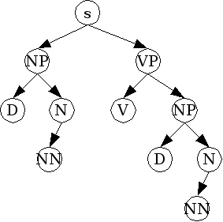
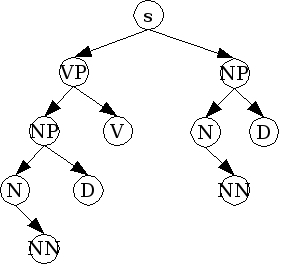

# Binary Trees

### Before you start:
Download the following files: BinaryNode.java  BinaryTree.java  BinaryTreeTest.java

### Exercise 1:
Write the missing `constructors` and `toString` method in the **BinaryTree** class.  
The toString method should produce a string representation of the following format:  
"[S [NP D [N NN]] [VP V [NP D [N NN]]]]"  
To view your tree you can use the following web application: http://ironcreek.net/phpsyntaxtree/?

Fill in the JUnit test in **BinaryTreeTest** that builds the following tree and calls the `toString` method on the root of the tree (see the given code).

Hint: work your way from the bottom up, creating and combining trees as you go.

### Exercise 2:
Write the missing recursive mirror method in the **BinaryTree** class that swaps the left and right references at each node, creating a mirror image of the tree.

After calling the mirror method, the toString method should return:  
[S [VP [NP [N NN] D] V] [NP [N NN] D]]  
The tree above will then look like this:

